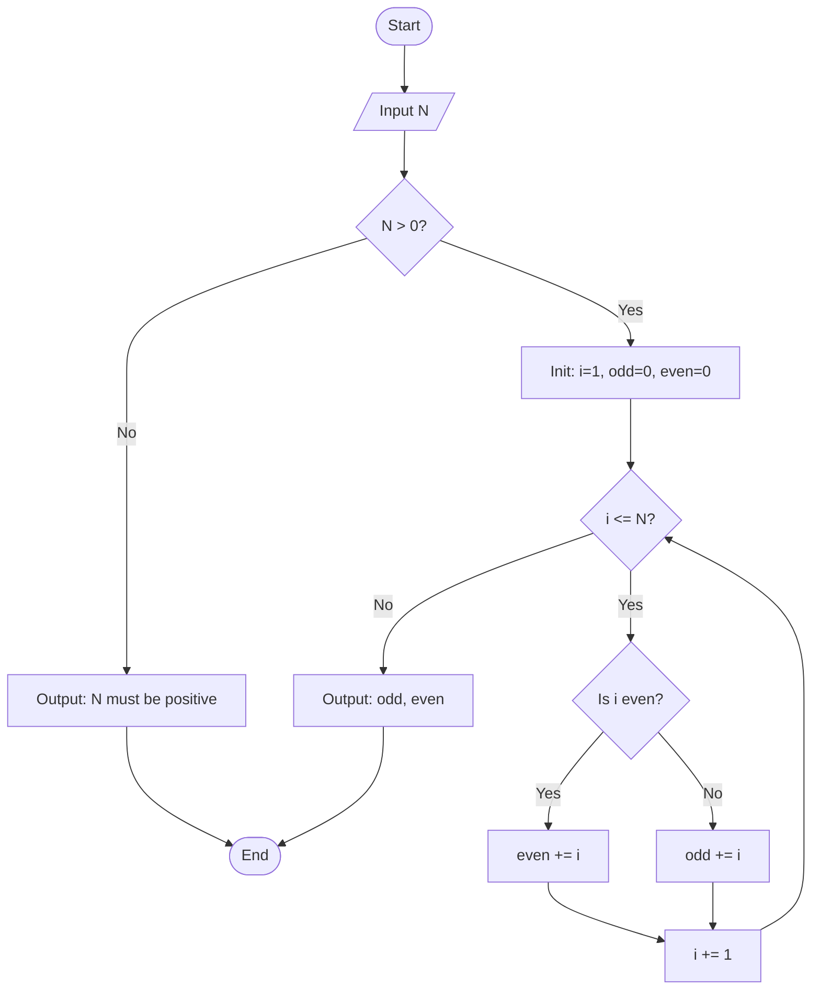

# Formatting-Test

```mermaid
flowchart TD
  A([Start]) --> B[/Input N/]
  B --> C{N > 0?}

  C -- No --> D[Output: N must be positive] --> Z([End])

  C -- Yes --> E[Init: i=1, odd=0, even=0]
  E --> F{i <= N?}

  F -- No --> G[Output: odd, even] --> Z

  F -- Yes --> H{Is i even?}
  H -- Yes --> I[even += i]
  H -- No  --> J[odd += i]

  I --> K[i += 1]
  J --> K
  K --> F

```
