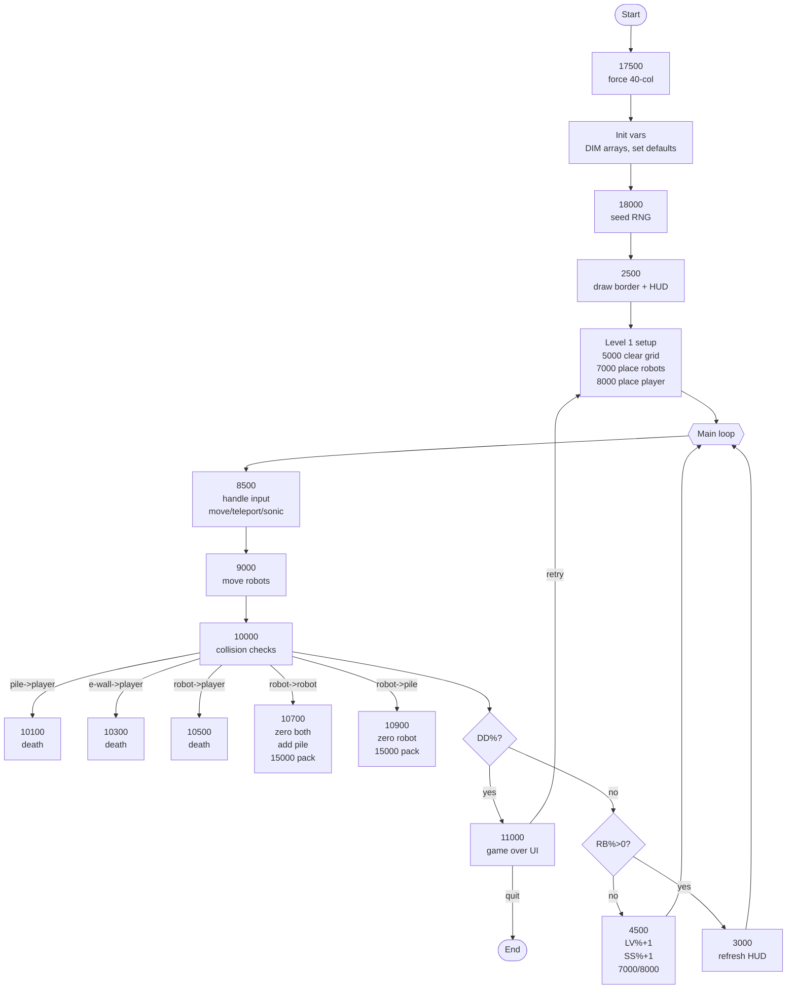

## Variable Reference

| Variable | Purpose | Starting value |
| --- | --- | --- |
| A$ | Border fill character for UI frame | `" "` |
| ST$ | Working string for centered titles in `18500` | `""` (set per call) |
| F1$ | Animation glyph 1 (collision/teleport) | `" "` |
| F2$ | Animation glyph 2 (collision/teleport) | `" "` |
| FX% | X coordinate used by animation routine | `0` |
| FY% | Y coordinate used by animation routine | `0` |
| RS$ | Reason-for-death message shown on game over | `""` |
| MR% | Max robot slots; bounds the RX%()/RY%() arrays | `45` |
| RB% | Current live robot count | `0` (set to `LV%*3` in `7000`) |
| PT% | Pile clear toggle; `1` to auto-clear on collision | `1` |
| TZ% | Teleport accuracy (0–4). Decays on teleport, regens every 2 moves | `4` |
| PC% | Current pile count | `0` |
| WX% | Previous player X (for erasing old position) | `0` |
| WY% | Previous player Y (for erasing old position) | `0` |
| EC% | Current electrowall count | `0` |
| DD% | Death flag (`1` ends game loop) | `0` |
| LS% | Last-stand score multiplier | `1` |
| X1% | Left grid bound (inclusive) | `2` |
| Y1% | Top grid bound (inclusive) | `2` |
| XM% | Right grid bound (inclusive) | `24` |
| YM% | Bottom grid bound (inclusive) | `23` |
| ZX% | Player X coordinate | `0` (set on first teleport) |
| ZY% | Player Y coordinate | `0` (set on first teleport) |
| SC% | Current score | `0` |
| HI% | High score | `0` |
| LV% | Current level | `1` (after first setup) |
| MV% | Move counter for current level | `0` |
| SS% | Sonic screwdriver stock | `1` |
| AC | HUD accuracy percent (`TZ%*25`) | Computed |
| P$ | HUD pile-clear display string | Derived from `PT%` |
| TL% | Teleport regen counter; +1 per move, resets after regen | `0` (implicit) |
| AZ% | Clamped copy of `TZ%` used in teleport logic | Set in `8000` |
| NX% | Candidate teleport X coordinate | Set in `8000` |
| NY% | Candidate teleport Y coordinate | Set in `8000` |
| OK% | Teleport validity flag | Set in `8000` |
| DX% | Player X delta from input | Set in `8500` |
| DY% | Player Y delta from input | Set in `8500` |
| OX% | Old robot X (scalar) for redraw | Set in `9000` |
| OY% | Old robot Y (scalar) for redraw | Set in `9000` |
| AD | Small delay counter for animations | Set in `13000` |
| CR$ | Spinner character set for teleport animation | `"!/-\\"` |
| Q$ | Holds `"` for animation (not printed) | `CHR$(34)` |
| A | Keyboard byte from `PEEK(49152)` | Set in `14500` |
| K$ | Sanitized key pressed by player | Set in `14500` |
| S% | Counter used to seed RNG from key delay | Set in `18000` |
| RS | Result of `RND(-S%)` seeding call | Set in `18000` |
| B | Centering offset used by `18500` | Computed |
| R | Loop counter for drawing borders | Set in `2500` |
| I, J, K, Q, T, AD | General loop counters used across routines | Set per use |

## Array Reference

| Array | Purpose | Size / bounds |
| --- | --- | --- |
| RX%() | Robot X coordinates; indices 1..`LV%*3` (max `MR%`) | `MR%+1` elements (0..45) |
| RY%() | Robot Y coordinates aligned with RX%() | `MR%+1` elements (0..45) |
| PX%() | Pile X coordinates | 24 elements (0..23) |
| PY%() | Pile Y coordinates aligned with PX%() | 24 elements (0..23) |
| EX%() | Electrowall X coordinates | 51 elements (0..50) |
| EY%() | Electrowall Y coordinates aligned with EX%() | 51 elements (0..50) |

## Function / Routine Reference

| Start line | Name | Purpose |
| --- | --- | --- |
| 2500 | UI init | Draw 25x24 border, controls, and prime HUD. |
| 3000 | HUD update | Refresh level, score, moves, robots, sonic, accuracy, pile toggle. |
| 4500 | Next level | Increment level, add sonic, place new robots/player. |
| 5000 | Grid clear | Wipe playfield, reset robots/piles/electrowalls to zeroed arrays. |
| 7000 | Place robots | Spawn `LV%*3` robots at random empty tiles and draw them. |
| 8000 | Teleport | Teleport player with accuracy/decay rules and animation. |
| 8500 | Player turn | Read input, handle toggles/teleport/sonic/last stand, move player. |
| 9000 | Robot turn | Move each robot 1 step toward player and redraw. |
| 10000 | Collision check | Orchestrates collision checks (pile-player, e-wall, robot-player, robot-robot, robot-pile). |
| 10700 | Robot-robot hit | Animation, zero both robots, add pile, score, return to caller. |
| 10900 | Robot-pile hit | Animation, zero robot, add score, return to caller. |
| 11000 | Game over | Show messages, accept quit/retry, restore scores. |
| 13000 | Animation | Blink between `F1$`/`F2$` or teleport spinner. |
| 14500 | Get key | Poll keyboard, uppercase letters, allow 0-9/A-Z, return in `K$`. |
| 15000 | Pack robots | Compact live robots into leading slots, recount `RB%`. |
| 17500 | Force 40-col | Ensure 40-column output mode across Apple II models. |
| 18000 | RNG seed | Wait for key timing to seed `RND` without a clock. |
| 18500 | Center string | Center `ST$` on 28-column line inside sidebar. |

## High-level Flow

